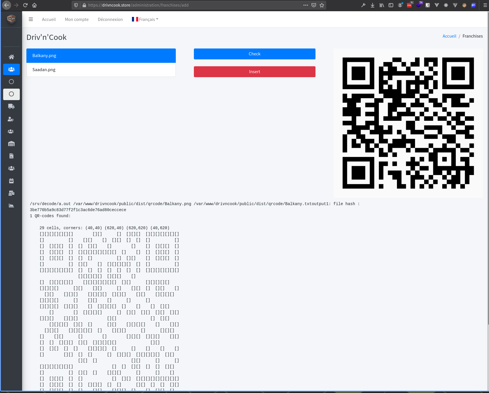

# Driv'n'Cook

Projet annuel de deuxième année.
Ce repos et en lien avec le repos du site web [drivncook](https://github.com/MaaximeLH/drivncook)

C'est un ensemble de 3 applications C qui permettent:
- de crée un fichier contenant les infos d'un franchisée 
- et de lui généré un QRcode qui est un hash de ses information
- de crée l'utilisateur dans la base de donnée si il correspond avec le fichier

il les deux dernier programmes sont utilisé par cette interface : 

